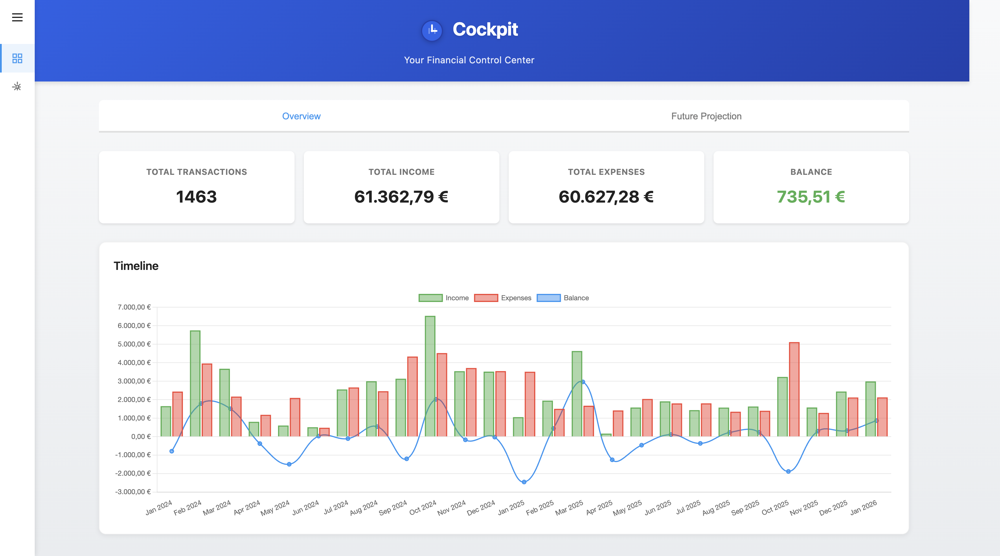
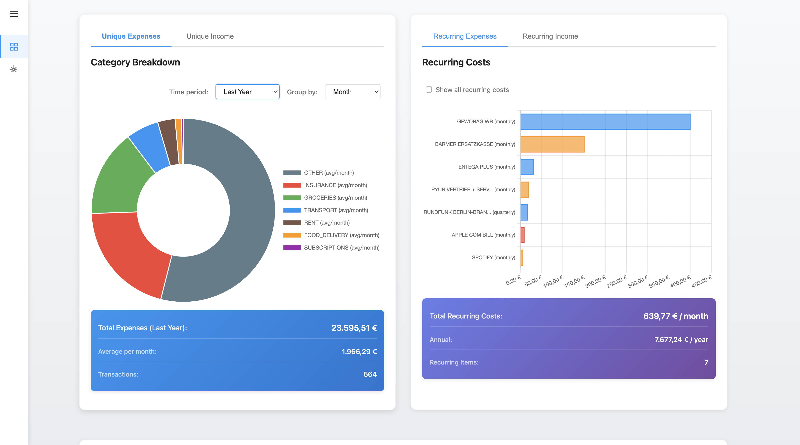
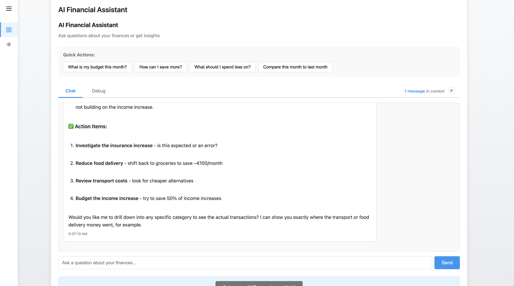
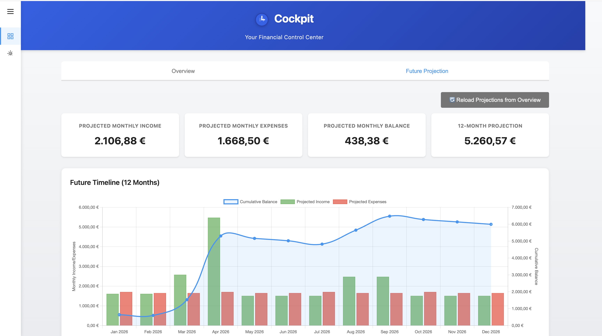

# Cockpit - Financial Control Center for DKB

Your personal financial command center for **Deutsche Kreditbank (DKB)** accounts. Analyze and visualize bank transactions from DKB CSV exports or connect directly to your DKB account, with automatic categorization, recurring cost detection, budget calculation, future projections, and AI-powered financial insights.

> **Note**: This application is specifically designed for DKB (Deutsche Kreditbank) accounts and German banking CSV formats.

## Screenshots

### Dashboard Overview

*View your total transactions, income, expenses, and balance with an interactive timeline chart*

### Category Breakdown & Recurring Costs

*Analyze spending by category and track recurring expenses like subscriptions and utilities*

### AI Financial Assistant

*Ask questions about your finances and get AI-powered insights and action items*

### Future Projections

*Project your finances 12 months ahead based on recurring income and expenses*

## Features

### Core Features
- **DKB CSV Import** - Parse DKB CSV exports (semicolon-delimited, German date/number format)
- **DKB Direct Connection** - Fetch transactions directly from your DKB account (requires 2FA via DKB app)
- **Accurate Balance Tracking** - Timeline chart shows cumulative balance calculated from actual DKB account balance
- **Automatic Categorization** - Rule-based categorization with German merchants (REWE, LIDL, BOLT, etc.)
- **AI Categorization** - Use Claude AI to intelligently categorize transactions
- **Manual Override** - Click any category to change it, persisted to localStorage
- **Transaction List** - Sortable, filterable list with pagination
- **Recurring Cost Detection** - Automatically detect weekly, monthly, quarterly, and yearly recurring payments
- **Budget Calculator** - Calculate budget for custom time periods with monthly averages
- **Interactive Charts** - Timeline, category breakdown, and recurring costs visualizations
- **Filters** - Date range, category, search, and amount filters
- **Future Projections** - Project your finances 12 months ahead based on recurring patterns
- **Settings Management** - Manage data sources, AI configuration, and reset options from centralized settings
- **Export** - Export budget reports and filtered transactions

### AI Features
- **AI Categorization** - Use Claude AI to automatically categorize transactions
- **Financial Q&A** - Ask questions about your finances and get intelligent answers
- **Future Projection Q&A** - Ask questions about your projected financial future
- **Spending Insights** - Get AI-powered insights and recommendations
- **Smart Analysis** - AI analyzes patterns and provides actionable advice

### Privacy First
- All processing happens in your browser
- No data sent to external servers (except optional AI features)
- Settings stored in localStorage
- CSV data never leaves your machine
- DKB credentials are only stored locally (optional)

## Tech Stack

- **Framework**: Vite + Vanilla JavaScript (ES6+)
- **Visualization**: Chart.js for financial charts
- **CSV Parsing**: PapaParse library
- **Date Handling**: date-fns for date manipulation
- **AI**: Anthropic Claude API (optional)
- **DKB Integration**: [dkb-robo](https://github.com/grindsa/dkb-robo) Python library
- **Storage**: localStorage for settings
- **Docker**: Containerized deployment

## Quick Start with Docker

### Prerequisites
- Docker and Docker Compose installed
- DKB account OR DKB CSV export file

### Start the Application

```bash
# Clone the repository
git clone https://github.com/kryptokommunist/cockpit.git
cd cockpit

# Build and start the containers (frontend + backend)
docker-compose up webapp

# Application will be available at http://localhost:3000
# Backend API runs on http://localhost:3001
```

### Stop the Application

```bash
docker-compose down
```

## Data Sources

### Option 1: DKB CSV Import
Export transactions from your DKB online banking and upload the CSV file:
- **Delimiter**: Semicolon (;)
- **Date Format**: DD.MM.YY (e.g., "25.01.26")
- **Amount Format**: German decimal (comma separator, e.g., "123,45")

### Option 2: DKB Direct Connection
Connect directly to your DKB account to fetch transactions:
1. Click "Connect to DKB" button
2. Enter your DKB username and password
3. Confirm the login on your DKB banking app (2FA)
4. Select which account to import
5. Transactions are fetched and displayed

**Note**: DKB connection uses the [dkb-robo](https://github.com/grindsa/dkb-robo) library with Friendly Captcha solving.

## AI Configuration

The AI features use Anthropic's Claude API through a local proxy.

**Configuration Steps:**
1. **Open Settings**: Navigate to Settings page via sidebar
2. **Enter API Details**:
   - Base URL: Your API proxy URL (e.g., `http://127.0.0.1:9988/anthropic/`)
   - API Token: Your Anthropic API token
   - Model: `anthropic--claude-4.5-sonnet` (or your preferred model)
3. **Test Connection**: Click "Test Connection" button

### AI Features

1. **AI Categorization**
   - Automatically categorize transactions using Claude AI
   - Batch processing with progress indicator
   - Discovers new categories intelligently

2. **Financial Q&A (Overview Tab)**
   - Ask questions like:
     - "How can I save more money?"
     - "What are my biggest expenses?"
     - "Compare this month to last month"
   - Get personalized insights based on your actual data

3. **Future Projection Q&A (Future Tab)**
   - Ask questions like:
     - "What will my balance be in 6 months?"
     - "Can I afford a 1000 purchase?"
     - "What are my recurring costs?"
   - Plan your financial future with AI assistance

## Categories

The following categories are automatically detected:

- **GROCERIES** - REWE, Lidl, ALDI, EDEKA, DM, Rossmann, Penny, Kaufland, Netto
- **TRANSPORT** - BOLT, Uber, Taxi, BVG, DB, Deutsche Bahn, Lime, Tier
- **FOOD_DELIVERY** - HelloFresh, Lieferando, Wolt, Deliveroo, Gorillas
- **SUBSCRIPTIONS** - Spotify, Apple, Microsoft, Netflix, Amazon Prime, Google
- **UTILITIES** - ENTEGA, Vattenfall, Stadtwerke, Telekom, Vodafone, O2
- **INSURANCE** - BARMER, TK, AOK, Allianz, HUK
- **INCOME** - Salary, payments received
- **RENT** - Housing rent
- **CASH** - ATM withdrawals
- **OTHER** - Uncategorized (can be AI-categorized)

## Usage Guide

### 1. Load Data
- **CSV Upload**: Click "Choose CSV File" or drag and drop your DKB CSV export
- **DKB Connection**: Click "Connect to DKB" and follow the authentication flow
- **Auto-load**: Place a `umsatz.csv` file in the project root for automatic loading

### 2. View Dashboard (Overview Tab)
- **Summary Cards**: See totals for transactions, income, expenses, and balance
- **Timeline Chart**: Visualize income/expenses over time with cumulative balance (uses actual DKB account balance for accurate tracking)
- **Category Chart**: See spending distribution by category (doughnut chart)
- **Recurring Costs**: View detected recurring payments (bar chart)
- **AI Assistant**: Ask questions about your current finances

### 3. Plan Future (Future Projection Tab)
- **Projected Summary**: See projected monthly income, expenses, and balance
- **12-Month Projection**: View cumulative projection over the next year
- **Future Charts**: Visualize projected spending patterns
- **AI Assistant**: Ask questions about your financial future

### 4. Filter & Analyze
- **Date Range**: Select start and end dates
- **Categories**: Multi-select categories to include
- **Search**: Search by merchant name or purpose
- **Amount**: Filter by minimum/maximum amount

### 5. Manage Categories
- Click on any category badge in the transaction list
- Select a new category from the dropdown
- Or use AI categorization for bulk updates

### 6. Settings
- **Data Source**: View connection status, refresh DKB data, or disconnect/clear data
- **AI API Configuration**: Configure API URL, token, and model for AI features
- **Data Management**: Reset projections or clear all application data
- **Recategorization Rules**: Manage automatic category mapping rules

## Project Structure

```
cockpit/
├── index.html                          # Main HTML entry
├── package.json                        # Dependencies
├── vite.config.js                      # Vite configuration
├── Dockerfile                          # Frontend container
├── Dockerfile.backend                  # Backend container (Node.js + Python)
├── docker-compose.yml                  # Docker orchestration
├── screenshots/                        # Application screenshots
├── server/
│   ├── index.js                        # Backend API server
│   ├── dkbService.js                   # DKB API integration
│   ├── dkb_fetch.py                    # Python script for DKB data fetching
│   └── get_captcha_token.py            # Friendly Captcha solver
├── src/
│   ├── main.js                         # Application initialization
│   ├── parser/
│   │   └── csvParser.js                # CSV parser for German format
│   ├── models/
│   │   └── Transaction.js              # Transaction data model
│   ├── services/
│   │   ├── categorizer.js              # Auto-categorization engine
│   │   ├── recurringDetector.js        # Recurring cost detection
│   │   ├── budgetCalculator.js         # Budget calculations
│   │   ├── settingsManager.js          # Settings persistence
│   │   ├── projectionService.js        # Future projection calculations
│   │   ├── dkbService.js               # Frontend DKB service
│   │   └── llmService.js               # AI integration (Claude API)
│   ├── visualizations/
│   │   ├── chartManager.js             # Chart.js orchestration
│   │   ├── futureChartManager.js       # Future projection charts
│   │   ├── timelineChart.js            # Timeline visualization
│   │   ├── categoryChart.js            # Category breakdown
│   │   └── recurringChart.js           # Recurring costs view
│   ├── ui/
│   │   ├── sidebar.js                  # Navigation sidebar
│   │   ├── fileUpload.js               # CSV file upload handler
│   │   ├── dkbModal.js                 # DKB connection modal
│   │   ├── filters.js                  # Date/category filters
│   │   ├── transactionList.js          # Transaction table
│   │   ├── budgetView.js               # Budget calculation UI
│   │   ├── baseQA.js                   # Base Q&A component
│   │   ├── financialQA.js              # AI Q&A interface (Overview)
│   │   ├── futureFinancialQA.js        # AI Q&A interface (Future)
│   │   ├── futureProjectionView.js     # Future projection UI
│   │   └── settingsView.js             # Settings page
│   └── utils/
│       ├── dateUtils.js                # German date parsing
│       └── numberUtils.js              # German number parsing
└── styles/
    ├── main.css                        # Global styles
    ├── components.css                  # Component styles
    └── charts.css                      # Chart customizations
```

## Development

See [CLAUDE.md](./CLAUDE.md) for development workflow instructions.

### Quick Commands

```bash
# Start development environment
docker-compose up webapp

# View logs
docker-compose logs -f webapp

# Rebuild after changes
docker-compose build webapp && docker-compose up webapp

# Stop containers
docker-compose down
```

## Dependencies

### Python (Backend)
- [dkb-robo](https://github.com/grindsa/dkb-robo) - DKB banking API library
- [seleniumbase](https://github.com/seleniumbase/SeleniumBase) - Browser automation for captcha solving

### JavaScript (Frontend)
- Chart.js - Financial charts
- PapaParse - CSV parsing
- date-fns - Date manipulation

## Troubleshooting

### CSV Upload Issues
- Ensure the CSV is exported from DKB online banking
- File should use semicolon (;) delimiter
- Check date format is DD.MM.YY
- Verify amount format uses comma for decimals

### DKB Connection Issues
- Ensure you have the DKB banking app installed for 2FA
- Check that your credentials are correct
- The captcha solving may take up to 60 seconds
- If login fails, try again after a few minutes

### AI Features Not Working
- Check if API endpoint is accessible
- Verify API key is valid
- Check browser console for error messages

### Charts Not Displaying
- Ensure transactions are loaded
- Check browser console for JavaScript errors
- Try refreshing the page

## License

MIT License - See LICENSE file for details

## Acknowledgments

- Built with Vite, Chart.js, PapaParse, and date-fns
- AI powered by Anthropic Claude
- DKB integration powered by [dkb-robo](https://github.com/grindsa/dkb-robo)
- Designed specifically for DKB (Deutsche Kreditbank) accounts
